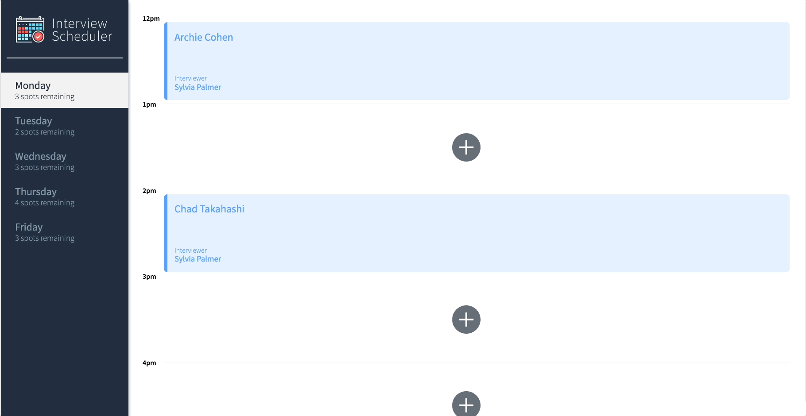
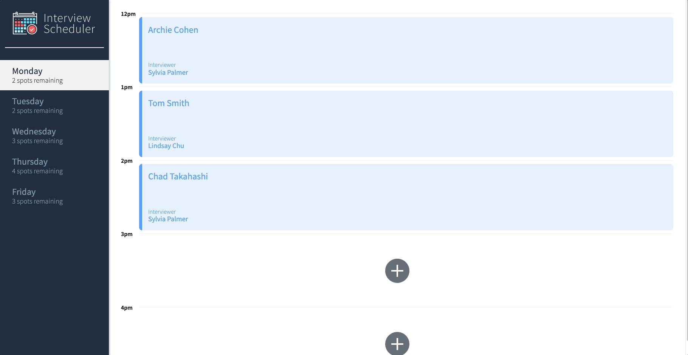
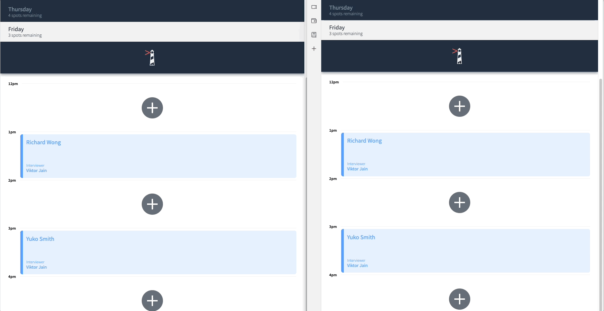

# Interview Scheduler

## Setup

Install dependencies with `npm install`.

Install and run [Scheduler-api](https://github.com/lighthouse-labs/scheduler-api)

## Running Webpack Development Server

```sh
npm start
```

## Running Jest Test Framework

```sh
npm test
```

## Running Storybook Visual Testbed

```sh
npm run storybook
```

## Running Cypress Test Framework
```sh
npm run cypress
```

### Overview of Web App & Creating New Appointment



### Editing and Deleting an Appointment



### Websock connections


## Functional Requirements
- Development focuses on a single page application (SPA) called Interview Scheduler, built using React.
- Data is persisted by the API server using a PostgreSQL database.
- The client application communicates with an API server over HTTP, using the JSON format.
- Jest tests are used through the development of the project.

## Behavioural Requirements
Booking an Interview
- Interviews can be booked between Monday and Friday.
- A user can switch between weekdays.
- A user can book an interview in an empty appointment slot.
- Interviews are booked by typing in a student name and clicking on an interviewer from a list of available interviewers.
- The list of days informs the user how many slots are available for each day.
- A user is shown an error if an interview cannot be saved or deleted.

Editing & Deleting an Interview
- A user can edit the details of an existing interview.
- A user can cancel an existing interview.
- A user is presented with a confirmation when they attempt to cancel an interview.
- The expected day updates the number of spots available when an interview is booked or canceled.
- A user is shown a status indicator while asynchronous operations are in progress.
- The application makes API requests to load and persist data. We do not lose data after a browser refresh.

## Dependencies
- React
- Webpack, Babel
- Axios, WebSockets
- Storybook, Webpack Dev Server, Jest, Testing Library